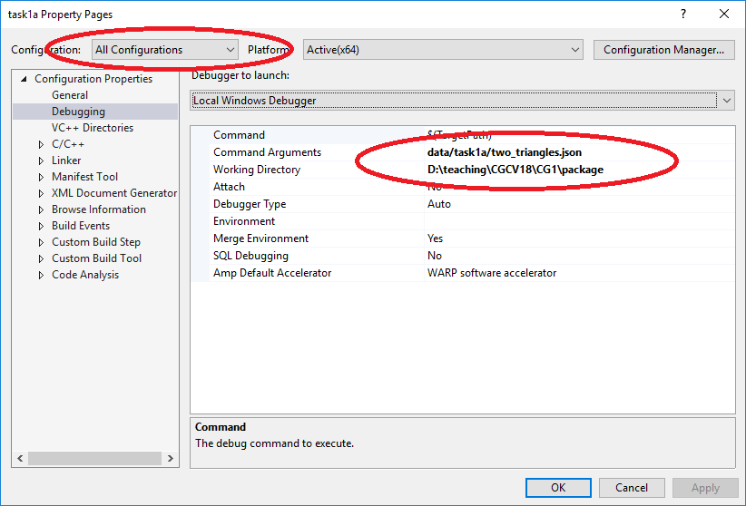

Here lies the framework provided for the exercises of the 2019 course ["Computer Graphics 2"](https://online.tugraz.at/tug_online/wbLv.wbShowLVDetail?pStpSpNr=213805) [1] at [Graz University of Technology](https://www.tugraz.at/home/) [2].

To build the framework, the following tools are needed

  * a C++ toolchain with C++17 support (e.g. GCC 8.x+, Visual Studio 2017)
  * [CMake 3.10+](https://cmake.org/) [4]

CMake scripts to generate a build system can be found in `build/cmake`.

Compiled applications will be placed in a subdirectory `./bin/` within the CMake binary directory.

## Windows

For working on Windows, we recommend to use the [Visual Studio 2017](https://www.visualstudio.com/) [3] IDE (Community Edition is sufficient). Note that the framework requires Version 15.5 and up.

Open the CMake 3.10 GUI application and point the CMake source path to the location of your `build/cmake` directory. Set the second path to point to the location where you would like your Visual Studio project files to be placed, e.g., `build/vs2017`.


Press [Configure] and select the Visual Studio 2017 generator


At this point, you can optionally edit the configuration and afterwards press [Generate].


Finally, open the generated Visual Studio 2017 solution that should now be found in the build directory specified earlier. Do not forget to set the correct startup project:


To set up the working directory and commandline arguments for launching your application from within the Visual Studio debugger, go to Project Properties > Debugging:




## Ubuntu

The default compilers currently shipping with Ubuntu do not offer full support for some of the C++17 features needed by the framework. A more up-to-date C++ toolchain such as g++ 8.x must be installed:

```bash
sudo apt-get install gcc-8 g++-8
```

On older versions of Ubuntu (e.g. Ubuntu 16.04), g++ 8.x is not available from default distribution repositories. You may be able to get a working build from other sources such as, e.g., the [`ubuntu-toolchain-r/test`](https://launchpad.net/~ubuntu-toolchain-r/+archive/ubuntu/test) [6] repository:

```bash
sudo add-apt-repository ppa:ubuntu-toolchain-r/test
sudo apt-get update
sudo apt-get install gcc-8 g++-8
```

Assuming you have installed [CMake 3.10](https://cmake.org/) [4] or newer as well as a suitable C++ toolchain, a build system can then be generated. First, switch into the directory where you want to the build files to be placed, for example:

```bash
cd /path/to/repository/build
mkdir blub
cd blub
```

Then, call cmake to generate the build system:

```bash
cmake -DCMAKE_C_COMPILER=gcc-8 -DCMAKE_CXX_COMPILER=g++-8 ../cmake/
```

The path to the `build/cmake` directory containing the CMake scripts (here `../cmake/`) has to be passed as the last argument to the `cmake` command. To use a compiler other than the system default, specify the `CMAKE_C_COMPILER` and `CMAKE_CXX_COMPILER` variables via the commandline as shown in the example above.

> Instead of using the commandline, you can install the `cmake-qt-gui` package to get a GUI application for managing the CMake generation process in essentially the same way as described in the Windows setup guide above. Use the "Specify native compilers" option in the generator selection dialogue to change the set of compilers to be used.

Once the build files have been generated, the project can be compiled using

```bash
make task1a
```


## pluto.tugraz.at

If you choose to work on [PLUTO](https://www.pluto.tugraz.at/) [7], suitable versions of CMake and GCC can be found in `/opt/cmake_3.12.2/` and `/opt/gcc820/`. Helper scripts are available to set up the environment to use these versions by default:

```bash
source /opt/gcc820/env-gcc-8.1.0.sh
source /opt/cmake_3.12.2/cmake-3.12.2-envs.sh
```

For convenience, the framework includes `setup_pluto.sh` to further simplify this process to:

```bash
source setup_pluto.sh
```

Once the default environment has been configured like this, you do *not* have to explicitly specify the compilers to CMake anymore. Note that you will have to reconfigure the environment on every login.


[1] https://online.tugraz.at/tug_online/wbLv.wbShowLVDetail?pStpSpNr=213805
[2] https://www.tugraz.at/home/
[3] https://www.visualstudio.com/
[4] https://cmake.org/
[5] http://apt.llvm.org/
[6] https://launchpad.net/~ubuntu-toolchain-r/+archive/ubuntu/test
[7] https://www.pluto.tugraz.at/
